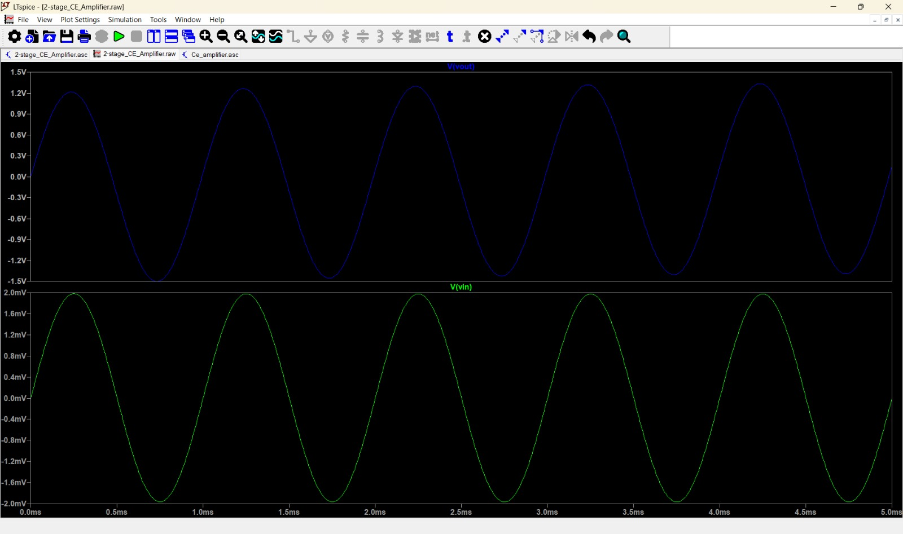

# Two-Stage Cascaded BJT Amplifier

A complete SPICE-simulated design of a two-stage Common-Emitter (CE) NPN bipolar junction transistor amplifier. This project demonstrates high-gain analog signal amplification with calculated DC biasing for maximum swing and a tuned AC frequency response.

## Repository Structure

* **`Documentation/`**: Contains the comprehensive mathematical analysis, design calculations, and a high-resolution PDF schematic (`CE_AmplifierSchematic.pdf`).
* **`images/`**: Visual assets, including circuit diagrams and simulation plots.
* **`netlist.cir`**: The universal SPICE netlist, allowing this circuit to be simulated in any standard SPICE engine (LTspice, Ngspice, PSpice, etc.) without needing the original graphical `.asc` file.

## Technical Specifications

* **Topology:** Two-Stage Cascaded Common-Emitter
* **Active Devices:** 2N2222 (modeled with realistic junction capacitances)
* **Supply Voltage ($V_{dd}$):** 12V Single-Rail
* **Load Resistance:** 1.5 kΩ
* **Mid-Band Voltage Gain:** ~60 dB 
* **Target Biasing:** $V_c = 0.5V_{dd}$ (6V), $V_e = 0.1V_{dd}$ (1.2V) for maximum unclipped output swing.

## Circuit Schematic

*The design utilizes voltage-divider biasing for thermal stability, with carefully sized AC coupling and bypass capacitors to set the dominant low-frequency poles.*

## Simulation Results

### Transient Analysis (Gain)

*Time-domain validation showing the amplified output signal against the input.*

### AC Sweep (Frequency Response)

*Bode plot demonstrating a stable bandpass characteristic. The lower cutoff frequency is precisely tuned to ~50 Hz, while the natural high-frequency roll-off is accurately captured in the megahertz range due to the 2N2222's internal parasitic capacitances.*

## How to Simulate

To run this simulation locally without LTspice:
1. Clone this repository.
2. Load `netlist.cir` into your preferred SPICE simulator.
3. Run a `.tran` command for time-domain analysis or a `.ac` command for frequency response.
