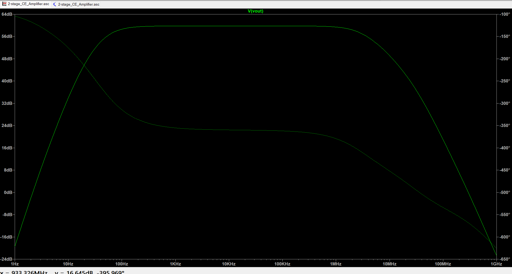

# Two-Stage BJT Common-Emitter Amplifier

## Overview
This repository contains the LTspice design and simulation of a two-stage cascaded NPN Bipolar Junction Transistor (BJT) amplifier. The circuit is engineered to meet specific voltage gain and biasing constraints while achieving a stable and physically realistic mid-band frequency response using the 2N2222 transistor model.

## Design Specifications
* **Supply Voltage :** 12V
* **Target Voltage Gain - Stage 1 :** 30 V/V
* **Target Voltage Gain - Stage 2 :** 20 V/V
* **Overall Target Voltage Gain :** 600 V/V (approx. 55.5 dB)
* **Load Resistance :** 1.5 kΩ
* **Biasing Constraints (for maximum unclipped swing):**
  * Collector Voltage = 0.5 Vdd (6V)
  * Emitter Voltage = 0.1 Vdd (1.2V)

## Circuit Topology

The circuit utilizes two Common-Emitter (CE) amplifier stages cascaded in series. 
* **Active Components:** The design uses the standard 2N2222 BJT model for both stages to ensure realistic simulation of parasitic capacitances.
* **Coupling & Bypassing:** AC coupling capacitors isolate the DC operating points of each stage. Emitter bypass capacitors short the AC signal to ground, preventing negative feedback (degeneration) and maximizing mid-band voltage gain.

## Component Values

### Resistors (DC Biasing and Gain Setting)
* **Stage 1:** R1 = 7.2 kΩ, R2 = 1.44 kΩ, Rc = 300 Ω, Re1 = 3 Ω, Re2 = 57 Ω
* **Stage 2:** R1 = 3.6 kΩ, R2 = 720 Ω, Rc = 150 Ω, Re1 = 3 Ω, Re2 = 27 Ω
* **Load:** Rl = 1.5 kΩ

### Capacitors (Frequency Response Tuning)
* **Input Coupling (C7):** 47 µF
* **Interstage Coupling (C5):** 33 µF
* **Output Coupling (C1):** 10 µF
* **Stage 1 Emitter Bypass (C4):** 1000 µF
* **Stage 2 Emitter Bypass (C3):** 1000 µF

## Simulation Results (AC Analysis)

An AC sweep from 1 Hz to 1 GHz was performed to evaluate the amplifier's frequency response. The resulting Bode plot demonstrates a textbook bandpass characteristic:

* **Mid-Band Gain:** The amplifier achieves a stable, flat mid-band voltage gain of approximately 60 dB. This amplification region is highly linear, spanning consistently from roughly 100 Hz up to 1 MHz.
* **Low-Frequency Response:** The lower -3 dB cutoff frequency is precisely positioned in the sub-100 Hz range. The curve rolls off smoothly below this point, confirming that the coupling and bypass capacitors are correctly sized to pass the desired signal frequencies without premature attenuation.
* **High-Frequency Response:** The upper -3 dB cutoff frequency occurs in the megahertz range (approximately 1 MHz to 5 MHz). The gain correctly and naturally decays at higher frequencies, accurately reflecting the bandwidth limitations imposed by the internal base-emitter and base-collector junction capacitances of the 2N2222 transistor model.
* **Effective Bandwidth:** The resulting bandwidth successfully covers a wide frequency range, demonstrating a stable design suitable for applications extending from the audio spectrum into the low-megahertz range.

## How to Run the Simulation
1. Clone this repository to your local machine.
2. Open the `2-stage_CE_Amplifier.asc` file in LTspice.
3. Click the **Run** button (the running figure icon).
4. Probe the input and output nodes to view the transient response, or view the generated Bode plot for the AC analysis.
